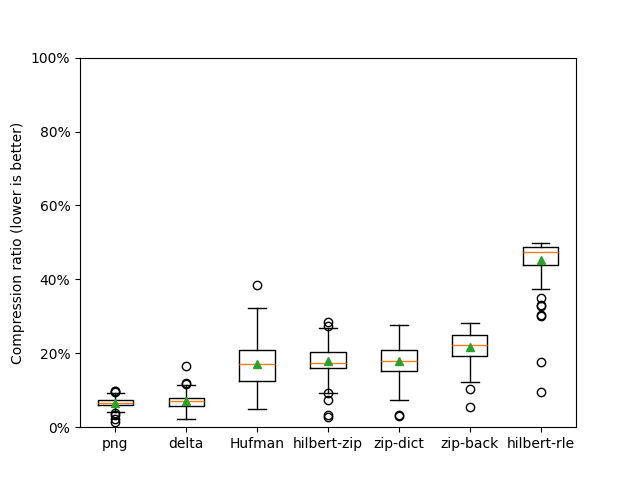

# C-niic

`cniic` (pronounced "C"-nic) is a Compilation of Naive Ideas for Image Compression.

#### What this is about

Have you ever asked yourself the following question?

> If I didn't know about the existing efficient image compression techniques and formats, how would I go about compressing an image?

Well, I did. And this is my attempt at an answer.

This repo implements a number of naive solutions to the general problem of image compression and measures their performance.

### Current status

#### Lossless codecs



Legend:
* `png`: The lossless PNG codec with default parameters
* `Hufman`: Hufman-coding the pixel colors
* `zip-dict`: Zip-inspired online dictionary building
* `zip-back`: Zip-inspired lookback compression

#### Lossy codecs


The error is computed as the mean square error of each pixel in every image.

Legend:
* `png`: The lossless PNG codec with default parameters
* `Hufman`: Hufman-coding the pixel colors
* `cluster-colors`: cluster the image colors using K-means, then apply Hufman-coding
  * results are shown for 16 colors (top-left), 32, 64, 128 and 256 (bottom-right)
* `voronoi`: cluster the pixels using K-means (position + color). Store only the clusters and reconstruct the image as a Voronoi diagram.
  * results are shown for 64 centroids (left), 128, 256, 512, 1024 and 2048 (right)
* `zip-dict`: Zip-inspired online dictionary building
* `zip-back`: Zip-inspired lookback compression

### ASCII art codec descriptions

Who doesn't love ASCII art?
In this section, it's used to help explain the various codecs listed above.

#### zip-dict

```
input:  0x01   0x02   0x01 0x02 0x01 0x02        0x0001 -> 0x01
          |      |    ^^^^^^^^^ ^^^^^^^^^          ...
          |      |        |       |              0x00ff -> 0xff
          v      v        v       v        +...> 0x0100 -> 0x01 0x02
output: 0x0001 0x0002   0x0100 0x0100      :     0x0101 -> 0x0100 0x0100
        ^^^^^^^^^^^^^    ^ ^ ^ ^ ^ ^       :                ^ ^ ^ ^ ^ ^
              +............................+             = 0x01 0x02 0x01 0x02
```
